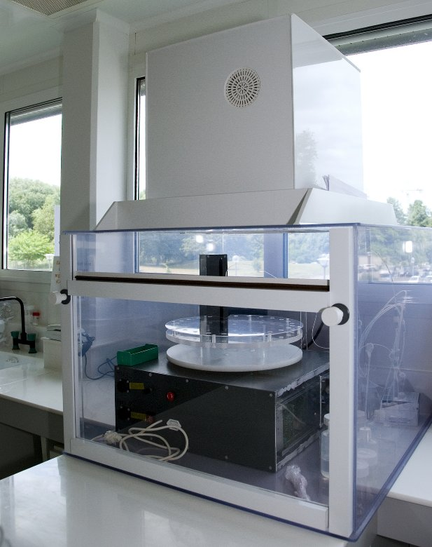

# ACE-Controller

## Automated Chromatographic Extractions

Automaton that performs chromatographic extractions (isolation and collection of chemical elements from solubilized natural matrices such as rock, mud, etc.). This automaton, unique of its kind, is used routinely for the analysis of isotopic ratios of geochemical markers (Sr, Nd, Pb, Zn, Cu, Fe, etc.). It has contributed to improving the quality and yield of the analyses.

